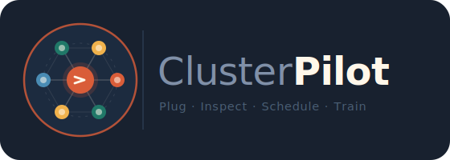
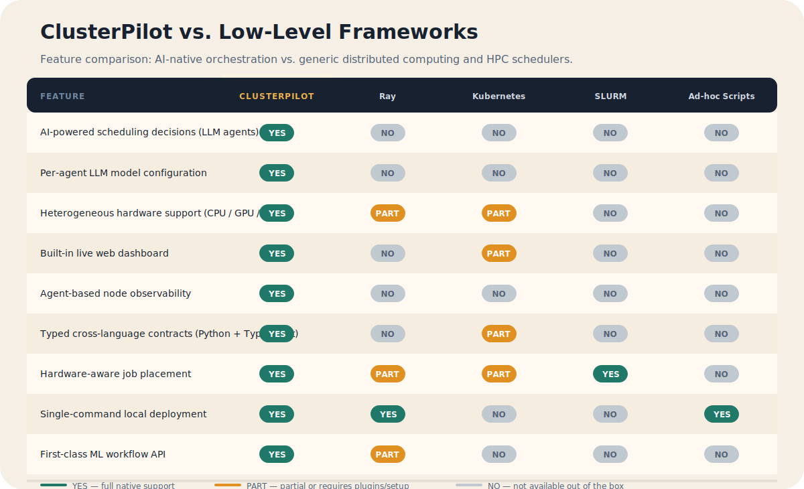
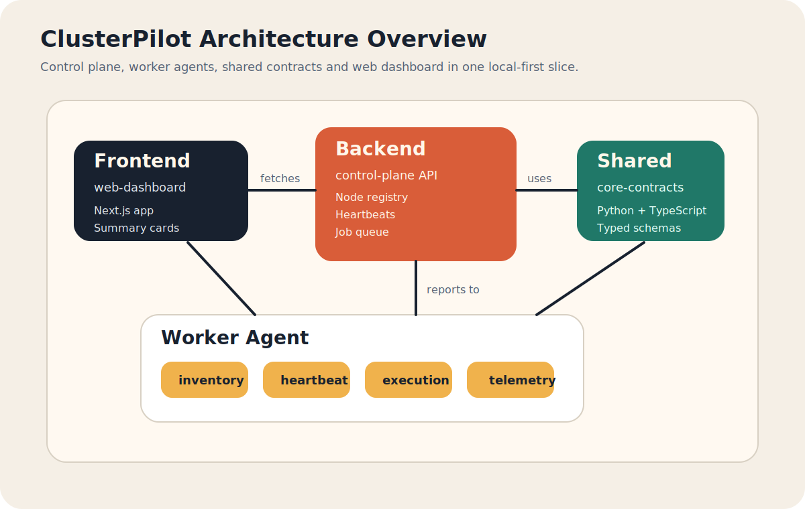
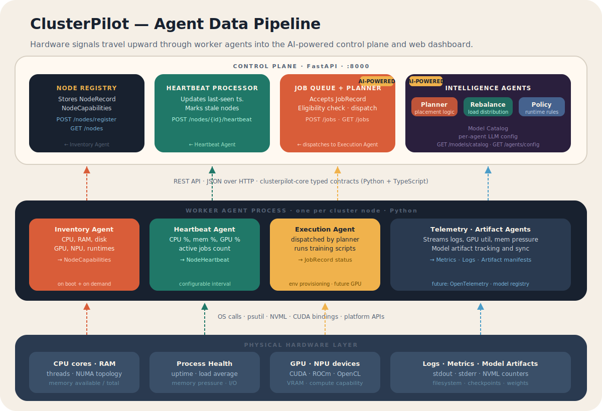
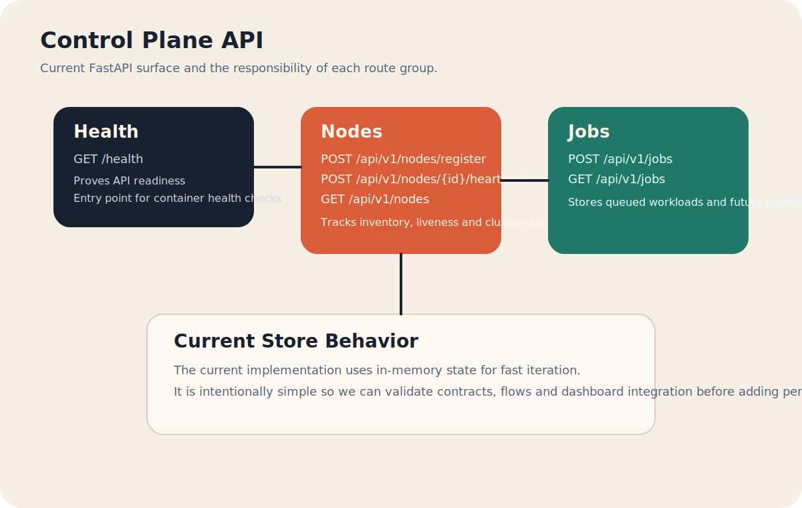
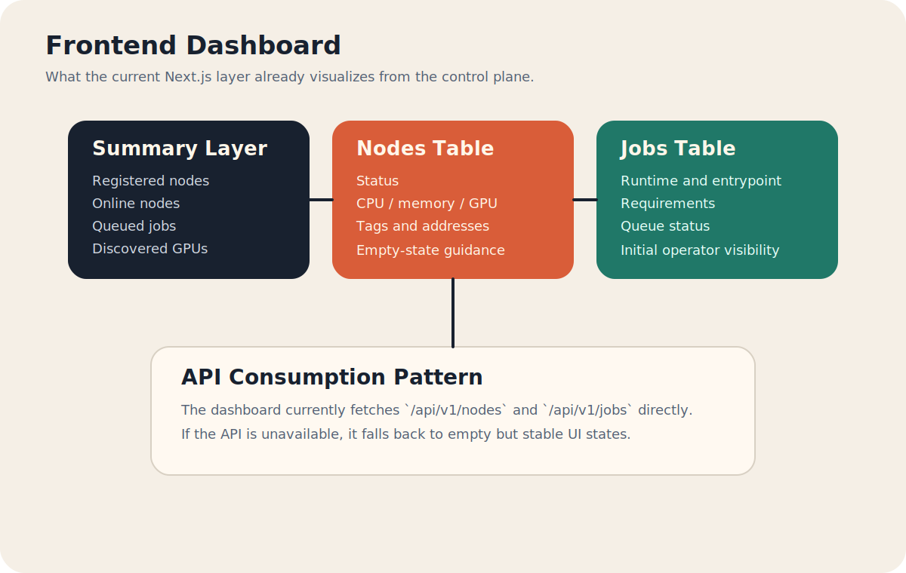

<div align="center">



**AI-native distributed orchestration for heterogeneous training clusters.**

[](LICENSE)
[](https://www.python.org/)
[](https://fastapi.tiangolo.com/)
[](https://nextjs.org/)
[](docker-compose.yml)

</div>

---

ClusterPilot is a distributed orchestration framework built specifically for AI training across heterogeneous CPU, GPU, and NPU clusters. Unlike general-purpose schedulers, ClusterPilot is **AI-native by design**: each orchestration function — placement, rebalancing, policy enforcement — is driven by a configurable LLM agent, not a fixed algorithm. The entire stack runs locally with a single `docker compose up`.

## Why ClusterPilot?



Existing tools are powerful but generic. **Ray** is a Python distributed computing library that requires manual task and actor management. **Kubernetes** is a container orchestrator with steep YAML overhead and no ML-specific primitives. **SLURM** is built for HPC batch jobs and lacks modern AI workflow APIs. None of them ship with AI-powered scheduling decisions, a live web dashboard, or typed cross-language contracts out of the box.

ClusterPilot fills that gap:

- **AI-powered control plane** — Planner, Rebalance, and Policy agents each run an LLM of your choice, making scheduling decisions from real hardware signals rather than fixed rules.
- **Model catalog** — register cloud and local models, assign them to specific agents, override prompts and temperature per agent.
- **Hardware-first inventory** — every worker node reports CPU, RAM, GPU/NPU devices, CUDA/ROCm capability, and available runtimes before any job is placed.
- **Unified typed contracts** — `clusterpilot-core` ships mirrored Pydantic (Python) and TypeScript models so the API surface is consistent end-to-end.
- **Zero-config local deployment** — three services, one compose file, works offline.

---

## Architecture Overview



ClusterPilot is organized into three integrated layers:

| Layer | Component | Responsibility |
|---|---|---|
| **Control Plane** | `backend/control-plane` | FastAPI REST API, node registry, job queue, AI intelligence agents |
| **Worker Agent** | `backend/worker-agent` | Per-node process: inventory, heartbeat, execution, telemetry, artifact |
| **Web Dashboard** | `frontend/web-dashboard` | Next.js app for cluster monitoring, job management, agent/model config |

Shared contracts live in `backend/core/clusterpilot_core` and are mirrored in `frontend/web-dashboard/lib/types.ts`.

---

## Agent Model



ClusterPilot defines **8 named agents** across two sides of the system:

### Worker-side agents (run on each node)

| Agent | Role | Output contract |
|---|---|---|
| `inventory` | Scans CPU, RAM, disk, GPU/NPU, runtimes | `NodeCapabilities` |
| `heartbeat` | Publishes liveness: CPU %, mem %, GPU %, active jobs | `NodeHeartbeat` |
| `execution` | Receives dispatched jobs, provisions env, runs scripts | `JobRecord` status updates |
| `telemetry` | Streams structured logs, GPU utilization, memory pressure | Metrics · Logs |
| `artifact` | Tracks and syncs model checkpoints and weights | Artifact manifests |

### Control-plane AI agents

| Agent | Role |
|---|---|
| `planner` | Selects target nodes for queued jobs based on hardware signals |
| `rebalance` | Redistributes load across the cluster when nodes degrade or recover |
| `policy` | Enforces runtime rules: priority, preemption, SLA constraints |

Each agent has an independently configurable LLM backend: provider, model ID, system prompt, custom prompt, temperature, and a manual override flag. Configuration is live — changes take effect without restarting any service.

---

## Control Plane API



### Node management

| Method | Route | Description |
|---|---|---|
| `GET` | `/health` | Service readiness check |
| `POST` | `/api/v1/nodes/register` | Register a new worker node with full capability inventory |
| `GET` | `/api/v1/nodes` | List all registered nodes with current status |
| `POST` | `/api/v1/nodes/{node_id}/heartbeat` | Update node liveness and runtime metrics |

### Job queue

| Method | Route | Description |
|---|---|---|
| `POST` | `/api/v1/jobs` | Submit a new training job with hardware requirements |
| `GET` | `/api/v1/jobs` | List all jobs and current status |

### Model and agent configuration

| Method | Route | Description |
|---|---|---|
| `GET` | `/api/v1/models/catalog` | List registered model catalog entries |
| `POST` | `/api/v1/models/catalog` | Register or update a model in the catalog |
| `GET` | `/api/v1/agents/config` | Get per-agent model and prompt configuration |
| `PUT` | `/api/v1/agents/config/{agent_name}` | Update a specific agent's LLM configuration |

---

## Web Dashboard



The Next.js dashboard connects to the control plane and provides:

**Main page (`/`)**
- Cluster summary cards (total nodes, online, degraded, queued jobs)
- Node inventory table with live status, capabilities, and heartbeat metrics
- Job queue table with status, runtime, and requirements

**Agent configuration (`/agents`)**
- Per-agent model selector from the registered catalog
- Custom system prompt and temperature overrides
- Enable/disable individual agents

**Model catalog (`/models`)**
- Register cloud (OpenAI, Anthropic, etc.) and local models
- Tag models and set recommended agents per model

---

## Quick Start

### Docker Compose (recommended)

```bash
git clone https://github.com/your-org/clusterpilot.git
cd clusterpilot
docker compose up --build
```

| Service | URL |
|---|---|
| Control Plane API | `http://localhost:8000` |
| Web Dashboard | `http://localhost:3000` |
| API docs (Swagger) | `http://localhost:8000/docs` |

The compose stack wires all services automatically. The worker agent registers itself on startup and begins sending heartbeats every 10 seconds.

### Manual setup

**Control plane:**

```bash
cd backend/control-plane
pip install -e ../../backend/core
pip install -e .
uvicorn app.main:app --reload --port 8000
```

**Worker agent:**

```bash
cd backend/worker-agent
pip install -e ../../backend/core
pip install -e .
python -m clusterpilot_agent
```

**Web dashboard:**

```bash
cd frontend/web-dashboard
npm install
npm run dev   # → http://localhost:3000
```

---

## Configuration Reference

### Worker Agent

| Variable | Default | Description |
|---|---|---|
| `CLUSTERPILOT_CONTROL_PLANE_URL` | `http://localhost:8000` | Control plane base URL |
| `CLUSTERPILOT_NODE_ID` | hostname | Unique identifier for this node |
| `CLUSTERPILOT_NODE_NAME` | hostname | Display name for this node |
| `CLUSTERPILOT_HEARTBEAT_SECONDS` | `10` | Heartbeat interval in seconds |

### Web Dashboard

| Variable | Description |
|---|---|
| `CLUSTERPILOT_API_BASE_URL` | Server-side API URL (used for SSR) |
| `NEXT_PUBLIC_CLUSTERPILOT_API_BASE_URL` | Client-side API URL (used in browser) |

---

## Repository Structure

```text
backend/
  control-plane/          FastAPI control plane service
    app/
      api/routers/        nodes · jobs · model_management
      application/        job_service · node_service · model_service
      infrastructure/     in-memory repositories (Redis-ready)
  worker-agent/           Python worker process
    clusterpilot_agent/   inventory · heartbeat · execution · telemetry · artifact agents
  core/                   clusterpilot_core — shared Pydantic models and settings

frontend/
  web-dashboard/          Next.js 15 dashboard
    app/                  / (cluster view) · /agents · /models
    components/           agent-config-manager · model-catalog-manager
    lib/                  api.ts · types.ts (mirrored from core)

docs/
  assets/
    brand/                clusterpilot-logo.svg
    diagrams/             architecture · agent pipeline · API · comparison
  superpowers/specs/      design documents
```

---

## Core Data Contracts

All API payloads are defined in `backend/core/clusterpilot_core/models.py` and mirrored to TypeScript in `frontend/web-dashboard/lib/types.ts`.

**Key models:**

- `NodeCapabilities` — CPU cores, RAM, disk, GPU/NPU count, OS, Python version, runtime versions, labels, metadata
- `NodeHeartbeat` — CPU %, memory %, GPU %, active job count, optional status message
- `NodeRecord` — full node state including capabilities, heartbeat snapshot, timestamps, and `NodeStatus` (online / degraded / offline)
- `JobRecord` — job ID, runtime, entrypoint, arguments, `JobRequirements` (min CPU, min RAM, min GPU, network profile), status, timestamps
- `AgentModelConfig` — per-agent LLM provider, model ID, prompts, temperature, enable flag
- `ModelCatalogItem` — provider, model, label, source (local/cloud), availability, recommended agents

---

## License

[MIT](LICENSE) — Nielsen
