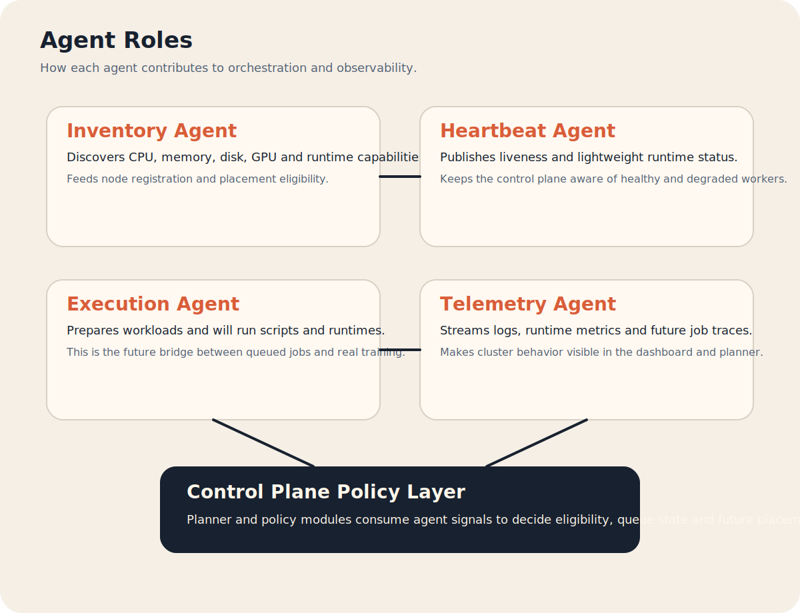

# ClusterPilot


ClusterPilot is a distributed orchestration framework for AI training across heterogeneous CPU, GPU and NPU clusters. The repository is now organized with a clear split between backend, frontend and shared contracts, and already contains the first working foundation slice of the platform.

## What Is Already Built

- `backend/control-plane`: FastAPI control plane MVP
- `backend/worker-agent`: Python worker agent MVP
- `frontend/web-dashboard`: Next.js dashboard MVP
- `shared/core-contracts`: mirrored Python and TypeScript contracts
- `docs/assets`: project logo and architecture diagrams

The current MVP already supports:

- node registration
- heartbeat updates
- capability inventory snapshots
- simple in-memory job queue creation
- dashboard visualization of nodes and jobs

## Repository Structure

```text
backend/
  control-plane/
  worker-agent/
frontend/
  web-dashboard/
shared/
  core-contracts/
docs/
  assets/
  superpowers/specs/
```

### Responsibility Split

- `backend/`: Python services and runtime-side components
- `frontend/`: user-facing web applications
- `shared/`: contracts reused by backend and frontend
- `docs/`: planning, brand and architecture documentation

## Architecture Overview


ClusterPilot currently connects three main pieces:

- the `control-plane` API, which receives node registration, heartbeats and jobs
- the `worker-agent`, which reports machine inventory and liveness
- the `web-dashboard`, which reads cluster and queue state from the API

The `shared/core-contracts` package keeps backend and frontend aligned on the same entities.

## Agent Model



The worker side is designed as one runtime with specialized internal roles:

- `inventory`: discovers CPU, memory, disk, GPU and runtimes
- `heartbeat`: keeps the control plane aware of online status
- `execution`: prepares the path for future workload execution
- `telemetry`: prepares the path for logs and metrics streaming

On the control-plane side, planner and policy modules will consume these signals to decide eligibility and future placement behavior.

## Control Plane API


FastAPI routes currently available:

- `GET /health`
- `GET /api/v1/nodes`
- `POST /api/v1/nodes/register`
- `POST /api/v1/nodes/{node_id}/heartbeat`
- `GET /api/v1/jobs`
- `POST /api/v1/jobs`

What the API is doing today:

- stores registered nodes in memory
- updates online state via heartbeat
- exposes node inventory to the dashboard
- stores queued jobs in memory
- exposes the first control-plane surface for cluster operations

## Frontend Dashboard


The dashboard consumes the control plane API and renders:

- cluster summary cards
- node inventory table
- job queue table
- stable empty states when the API is offline or still empty

Set `CLUSTERPILOT_API_BASE_URL` for the web app when the API is not at `http://localhost:8000`.

## Docker Compose

The repository now includes:

- [docker-compose.yml](docker-compose.yml)
- [Dockerfile](backend/control-plane/Dockerfile) for the control plane
- [Dockerfile](backend/worker-agent/Dockerfile) for the worker agent
- [Dockerfile](frontend/web-dashboard/Dockerfile) for the web dashboard

To build and start everything:

```bash
docker compose up --build
```

Services exposed locally:

- Control plane API: `http://localhost:8000`
- Frontend dashboard: `http://localhost:3000`

The compose stack wires the worker agent to the control plane automatically using:

- `CLUSTERPILOT_CONTROL_PLANE_URL=http://control-plane:8000`
- `CLUSTERPILOT_API_BASE_URL=http://control-plane:8000`

## Local Runtime Notes

The worker agent currently uses these environment variables:

- `CLUSTERPILOT_CONTROL_PLANE_URL`
- `CLUSTERPILOT_NODE_ID`
- `CLUSTERPILOT_NODE_NAME`
- `CLUSTERPILOT_HEARTBEAT_SECONDS`

The frontend uses:

- `CLUSTERPILOT_API_BASE_URL`
